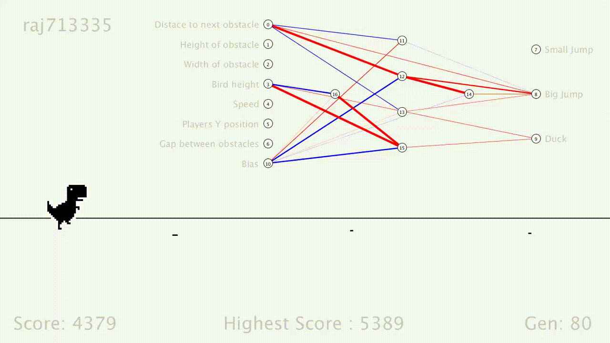

# DianoGame
Created a game taking inspiration from Goggle Chrome DianoGame using Processiong and Reinforcement Learning and Java.


<p align="center">
    
    <br>
    <sup>My Custom Game</sup>
</p>


## Getting Started
- Clone the repo and cd into the directory
```sh
$ git clone https://github.com/raj713335/DianoGame.git
$ cd DianoGame
```

- Install Processing 

```sh
$ url : https://processing.org/
```

- Run the Processing Application

```sh
$ processing.exe
```

## RUNNING THE APPLICATION


```sh
$ Application is written in processing framework using java
```
